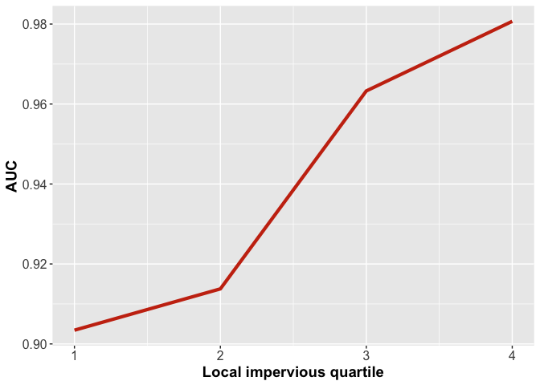
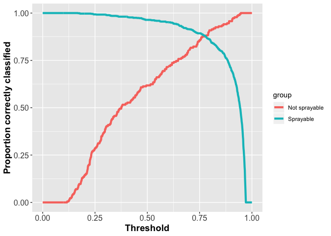

Predicting residential buildings
================

Background
----------

This post outlines the analytical approach taken to predict whether buildings are residential or not, published in PLoS ONE [here](https://journals.plos.org/plosone/article?id=10.1371/journal.pone.0204399). In summary, we use ensemble machine learning, stacking multiple machine learning algorithms to create a 'SuperLearner' algorithm which, in theory, produces high prediction accuracy than any of the algorithms on their own. I'm not going to provide a detailed explanation of stacking here, there are plenty of great descriptions out there, including this and [this](https://www.kdnuggets.com/2017/02/stacking-models-imropved-predictions.html). Here, we are going to focus on what we did.


First get the necessary libraries

    library(rgdal)
    library(cvAUC)
    library(Hmisc)
    library(rgdal)
    library(wesanderson)

Load the helper functions from the `helper_function.R` script

    source("helper_functions.R")

Then download OSM data using the geofabrik site

``` r
# Set country parameters
country_code <- "SWZ"
country <- "swaziland"
continent <- "africa"
```

    # Download
    to_download <- paste0("download.geofabrik.de/",continent,"/",country,"-latest-free.shp.zip")
    file <- basename(to_download)
    download.file(to_download, file)
    unzip(file, exdir = paste0(getwd(),"/osm_data/",country_code,"_OSM"))

    ## OGR data source with driver: ESRI Shapefile 
    ## Source: "/Users/hughsturrock/Documents/Work/MEI/DiSARM/GitRepos/OSM_download_parcelling/osm_data/SWZ_OSM", layer: "gis.osm_buildings_a_free_1"
    ## with 593365 features
    ## It has 5 fields

    ## OGR data source with driver: ESRI Shapefile 
    ## Source: "/Users/hughsturrock/Documents/Work/MEI/DiSARM/GitRepos/OSM_download_parcelling/osm_data/SWZ_OSM", layer: "gis.osm_roads_free_1"
    ## with 22614 features
    ## It has 10 fields
    ## Integer64 fields read as strings:  layer

    structures_poly <- readOGR(dsn = "osm_data_SWZ_OSM"), 
                               layer = "gis.osm_buildings_a_free_1")

    roads <- readOGR(dsn = "osm_data_SWZ_OSM"), 
                     layer = "gis.osm_roads_free_1")

Use the `get_data` function from the `helper_function.R` script to generate features/predictors for training (i.e. those buildings of known 'type') and prediction buildings (i.e. buildings of unknown 'type').

``` r
structure_points <- get_data(structures_poly, training=TRUE)
structure_points$sprayable <- ifelse(structure_points$type == "residential" | 
                                       structure_points$type == "house" | 
                                       structure_points$type == "detached" | 
                                       structure_points$type == "hut",1,0)

prediction_structure_points <- get_data(structures_poly, training=FALSE)
```

Generate training and test (10%) sets

``` r
set.seed(1981)
random_sprayables <- sample(which(structure_points$sprayable==1),sum(structure_points$sprayable==1)*0.1)
set.seed(1981)
random_non_sprayables <- sample(which(structure_points$sprayable==0),sum(structure_points$sprayable==0)*0.1)

structure_points_test <- structure_points[c(random_sprayables, random_non_sprayables),]
structure_points <- structure_points[-c(random_sprayables, random_non_sprayables),]
```

Prepare data for SuperLearner

``` r
# Try superlearner
pred_data = prediction_structure_points@data[,c("poly_area", 
                                     "dist_to_nearest", 
                                     "area_of_nearest", 
                                     "Impervious",
                                     "Impervious_buffer",
                                     "dist_to_nearest_road",
                                     "n_poly",
                                     "poly_complexity",
                                     "poly_complexity_of_nearest",
                                     "Impervious_of_nearest",
                                     "n_poly_of_nearest")]
```

Run SuperLearner

    sl_model_binom <- SuperLearner(
      Y = structure_points$sprayable,
      X = structure_points@data[,c("poly_area", 
                                   "dist_to_nearest", 
                                   "area_of_nearest", 
                                   "Impervious",
                                   "Impervious_buffer",
                                   "dist_to_nearest_road",
                                   "n_poly",
                                   "poly_complexity",
                                   "poly_complexity_of_nearest",
                                   "Impervious_of_nearest",
                                   "n_poly_of_nearest")],
      
      SL.library = c("SL.mean",
                     "SL.glm",
                     "SL.polymars",
                     "SL.glmnet",
                     "SL.randomForest",
                     "SL.gbm",
                     "SL.cforest",
                     "SL.xgboost",
                     "SL.earth",
                     "SL.gam"),
      family="binomial",
      newX = pred_data,
      method = method.AUC
    )

    ## Warning: namespace 'xgboost' is not available and has been replaced
    ## by .GlobalEnv when processing object 'sl_model_binom'

    ## Warning: namespace 'earth' is not available and has been replaced
    ## by .GlobalEnv when processing object 'sl_model_binom'

Take a look at the model output

``` r
sl_model_binom
```

    ## 
    ## Call:  
    ## SuperLearner(Y = structure_points$sprayable, X = structure_points@data[,  
    ##     c("poly_area", "dist_to_nearest", "area_of_nearest", "Impervious",  
    ##         "Impervious_buffer", "dist_to_nearest_road", "n_poly", "poly_complexity",  
    ##         "poly_complexity_of_nearest", "Impervious_of_nearest", "n_poly_of_nearest")],  
    ##     newX = pred_data, family = "binomial", SL.library = c("SL.mean",  
    ##         "SL.glm", "SL.polymars", "SL.glmnet", "SL.randomForest", "SL.gbm",  
    ##         "SL.cforest", "SL.xgboost", "SL.earth", "SL.gam"), method = method.AUC) 
    ## 
    ## 
    ## 
    ##                           Risk      Coef
    ## SL.mean_All         0.53004327 0.1435025
    ## SL.glm_All          0.25178722 0.0000000
    ## SL.polymars_All     0.13236479 0.0000000
    ## SL.glmnet_All       0.24976744 0.0000000
    ## SL.randomForest_All 0.06288333 0.7002511
    ## SL.gbm_All          0.11167633 0.0000000
    ## SL.cforest_All      0.15479534 0.0000000
    ## SL.xgboost_All      0.07836488 0.1562464
    ## SL.earth_All        0.12704345 0.0000000
    ## SL.gam_All          0.14016517 0.0000000

Calculate AUC using the test dataset

``` r
AUC(sl_model_binom$SL.predict, structure_points_test$sprayable)
```

    ## [1] 0.9453981

Calculate AUC by impervious (i.e. urbanicity) class

``` r
# Cut impervious values into 4
urban_class <- as.numeric(cut2(structure_points_test$Impervious_buffer, g=4))

# Loop through each class and calc AUC
AUC_by_impervious <- NULL
for(i in 1:length(unique(urban_class))){
  AUC_by_impervious <- c(AUC_by_impervious, AUC(sl_model_binom$SL.predict[urban_class==i], structure_points_test$sprayable[urban_class==i]))
}

# Prepare data for plotting
AUC_plot_data <- data.frame(AUC=AUC_by_impervious,
                            quantile=1:4,
                            Country=rep("SWZ",4))

ggplot(data=AUC_plot_data, aes(x=quantile, y=AUC)) + 
  geom_line(size=1.5,color=wes_palette("Royal1",2)[2]) +
  xlab("Local impervious quartile") + ylab("AUC") +
  theme(axis.text=element_text(size=12),
        axis.title=element_text(size=14,face="bold"))
```



To identify the best cutoff (i.e. prediction probability above which to classify something as 'residential') we opted to use the cutoff that produced the same sensitivity (proportion of truly residential that were correctly classified) and specificity (proportion of truly non-residential that were correctly classified). If our training data were a representitive sample of all buildings, we might choose not to play with this cutoff, but we couldn't guarentee that the ratio of residential:non-residential in the training data were representative.

Here we use the `optimal_cutoff` function from the `helper_functions.R` file which loops through multiple cutoffs and identifies which produces equal sensitivity to specificity.

``` r
# Identify optimal cutoff using training data and apply to test
opt_cutoff_SL <- optimal_cutoff(sl_model_binom$SL.predict, structure_points_test$sprayable)
ggplot(data=opt_cutoff_SL$plot_data, aes(x=threshold, y=perc_corr_class, group=group, color=group)) + 
  geom_line(size=1.5) + xlab("Threshold") + ylab("Proportion correctly classified") +
  theme(axis.text=element_text(size=12),
        axis.title=element_text(size=14,face="bold"))
```



``` r
opt_cutoff_SL$confusion_matrix
```

    ##                observations
    ## predicted_class   0   1
    ##               0 163  91
    ##               1  23 640
